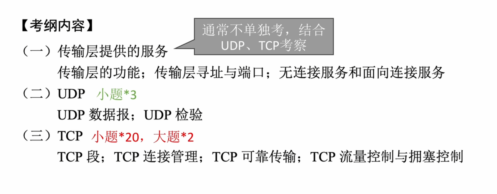
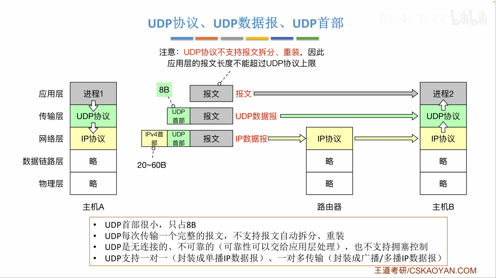
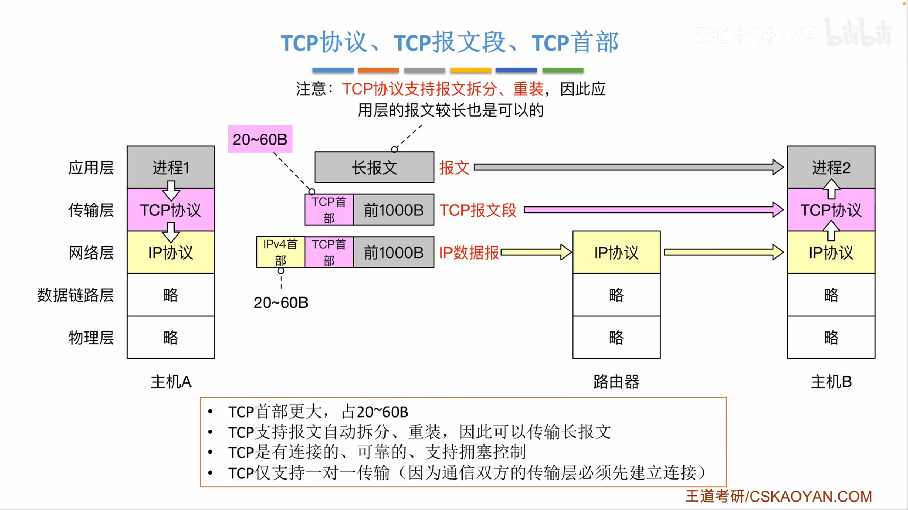
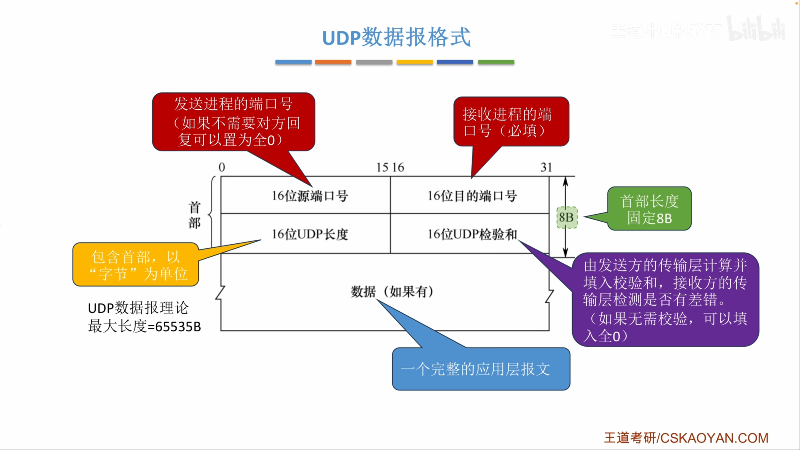
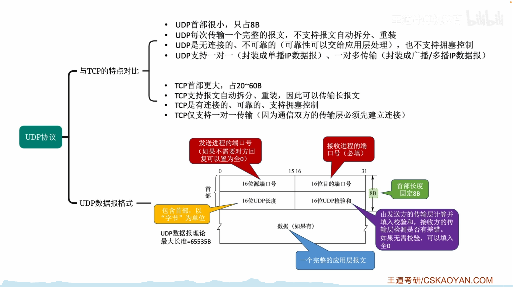
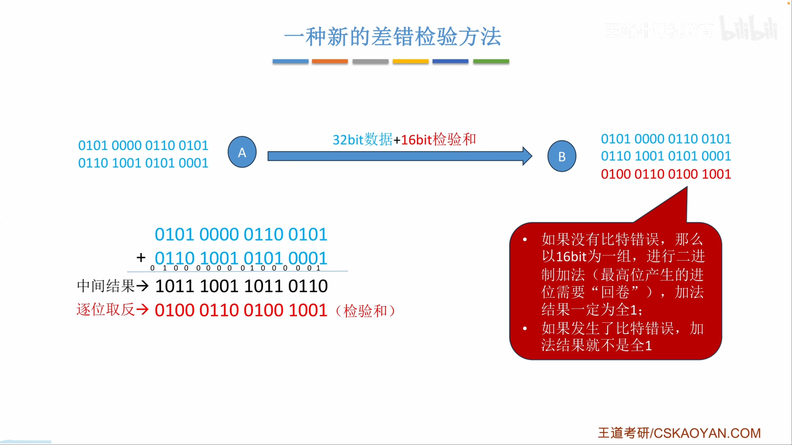
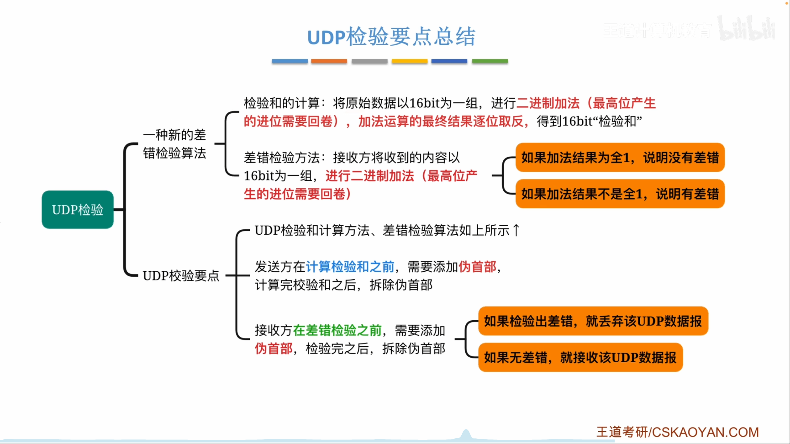
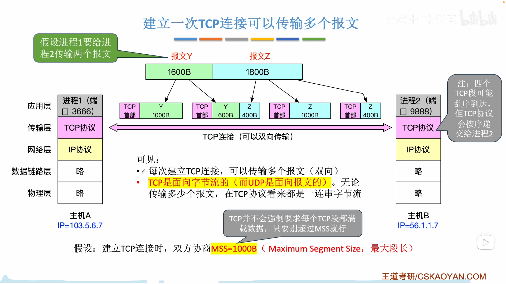
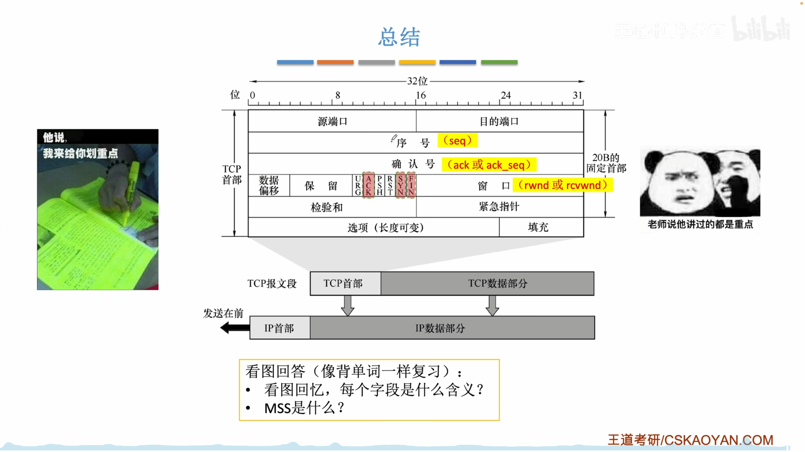
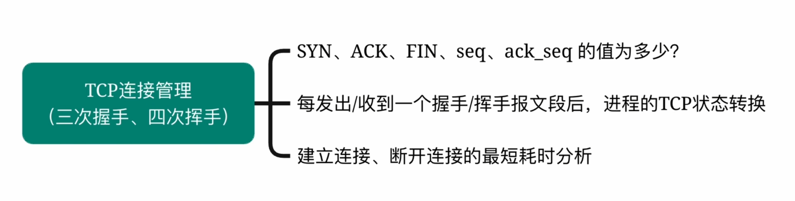

# 第五章 传输层

## 5.1 传输层提供的服务

网络层借助 IP 地址实现主机到主机的通信，传输层则借助端口号进一步实现进程到进程的通信。发送方传输层接收应用数据，加上 TCP 或 UDP 首部后交给 IP；接收方传输层根据目的端口把数据交给正确的应用进程。

```text
发送进程 -> TCP/UDP -> IP -> 网络 -> IP -> TCP/UDP -> 接收进程
             端口号    IP 地址          IP 地址    端口号
```

端口号长 16 位，取值范围是 `0` 至 `65535`。端口是每台主机、每种传输协议各自管理的资源，因此：

- 不同主机可以使用相同端口号。
- 同一主机上的 TCP 端口和 UDP 端口相互独立，例如 TCP 53 与 UDP 53 可以同时使用。
- 同一主机、同一传输协议中的端口不能被不兼容地重复绑定。

标准常把端口分为以下范围：

| 范围               | 名称          | 用途                              |
| ------------------ | ------------- | --------------------------------- |
| `0` 至 `1023`      | 熟知端口      | 分配给 HTTP、DNS、SMTP 等通用服务 |
| `1024` 至 `49151`  | 登记端口      | 可登记给特定应用或服务            |
| `49152` 至 `65535` | 动态/私有端口 | 常由客户端临时选择                |

服务器通常被动等待请求并绑定相对固定的端口，客户端主动发起通信并常使用临时端口。这个习惯不等于除熟知端口外的范围都具有强制的客户端、服务器归属。

套接字是程序使用网络通信端点的数据结构。对 TCP 连接，常用四元组唯一标识一条连接：

```text
(源 IP, 源端口, 目的 IP, 目的端口)
```

再加上传输协议，可区分 TCP 与 UDP 中数值相同的端口。

#### 复用与分用

- 复用发生在发送方向，多个应用进程都可把数据交给同一个 TCP 或 UDP 协议处理。
- 分用发生在接收方向，传输层依据协议和目的端口，把收到的数据交给对应进程。

TCP 和 UDP 都能用校验和检测比特差错，检测失败时都丢弃数据。区别在于，TCP 还用确认、重传、排序等机制恢复丢失或出错的数据，UDP 不负责恢复。

| 对比项   | TCP                              | UDP                          |
| -------- | -------------------------------- | ---------------------------- |
| 连接     | 面向连接，传输前建立、结束后释放 | 无连接，直接发送             |
| 可靠性   | 可靠、有序、无重复的字节流       | 尽最大努力交付               |
| 通信形式 | 一条连接对应两个端点，全双工     | 支持单播，也可配合广播或多播 |
| 流量控制 | 支持                             | 不支持                       |
| 拥塞控制 | 支持                             | 不支持                       |

## 5.2 UDP

### 5.2.1 UDP 数据报



UDP 面向报文。应用层每交付一个完整报文，UDP 就为它添加一个 8 字节首部，形成一个 UDP 数据报，并保留应用报文的边界。UDP 本身不负责把一个超长应用报文拆成多个 UDP 数据报，也不在接收端重组这些应用报文。



TCP 则面向字节流，可以把连续的应用数据按 MSS 切成多个 TCP 段，应用层原有的报文边界不会被 TCP 保留。



#### UDP 首部



UDP 长度字段的理论最大值为 `65535 B`。封装在无选项的 IPv4 数据报中时，受 IPv4 总长度限制，UDP 数据报最大为：

```text
65535 - 20 = 65515 B
```

其中还包括 8 B UDP 首部，因此应用数据最多为 `65507 B`。这是假设 IPv4 首部最短且不考虑链路 MTU 的上限，实际应用通常使用远小于该值的数据报，以免 IP 分片。

例如应用报文长 96 B，发送端口为 3666，接收端口为 9888，则 UDP 长度为：

```text
8 + 96 = 104 B
```

UDP 没有建立连接、确认重传、流量控制和拥塞控制，首部开销与发送时延较小。应用若需要可靠性，必须自行在应用层实现。UDP 可封装进单播、广播或多播 IP 数据报，因此适合实时音视频、DNS 查询等能容忍部分丢失或有自定义恢复机制的场景。



### 5.2.2 UDP 校验



UDP 使用 16 位反码校验和。计算前，把数据按 16 bit 分组，执行反码加法：普通二进制相加后，最高位产生的进位要回卷并加到最低位。发送方将最终和逐位取反，得到校验和。


```text
反码加法：16 位相加 -> 最高位进位回卷 -> 继续相加
发送方：所有字之和 -> 逐位取反 -> 写入校验和
接收方：所有字连同校验和相加 -> 结果全 1 表示通过
```

计算 UDP 校验和时，要临时在 UDP 数据报前增加 12 B IPv4 伪首部：


伪首部不是实际 UDP 首部，也不会在网络中传输。它让校验范围同时覆盖源、目的地址和上层协议号，可以检测数据报是否被错误地交给另一端点或另一协议。

发送端步骤：

1. 把 UDP 校验和字段暂置 0，构造伪首部。
2. 对伪首部、UDP 首部和数据按 16 bit 进行反码加法。若总字节数为奇数，在末尾临时补一个全 0 字节参与计算。
3. 将结果逐位取反，写入 UDP 校验和字段，再丢弃伪首部。

接收端重新构造同样的伪首部，把所有 16 位字连同收到的校验和一起做反码加法。结果为 16 位全 1 时接受，否则丢弃 UDP 数据报。

IPv4 中 UDP 校验和字段全 0 表示发送方未启用校验；IPv6 中 UDP 校验和通常必须使用。IPv4 首部校验和采用同一种反码算法，但只覆盖 IPv4 首部，不使用伪首部，也不覆盖 IP 数据部分。



## 5.3 TCP

### 5.3.1 TCP 协议的整体框架


TCP 工作分为三个阶段：三次握手建立连接，连接上进行全双工数据传输，四次挥手释放两个方向的连接。


主动发起连接的一方称为客户端，被动监听并接受连接的一方称为服务器。释放连接可以由任意一方先发起，不要求客户端先关闭。

TCP 连接是全双工的，两个方向各自独立传输。前两次挥手只说明一个方向不再发送数据，另一个方向仍可继续传输；待另一方也发送 FIN 并得到确认后，连接才完全关闭。



一次 TCP 连接可以连续传送多个应用报文，并不需要每传一个报文就重新握手。TCP 把应用层交来的数据视为连续字节流，按最大报文段长度 MSS 切分：

```text
应用报文 Y 1600 B | 应用报文 Z 1800 B
                  ↓ MSS = 1000 B
段1: Y[0..999]
段2: Y[1000..1599] + Z[0..399]
段3: Z[400..1399]
段4: Z[1400..1799]
```

一个 TCP 段的数据量可以小于 MSS，但不能超过协商的上限。MSS 只限制 TCP 数据部分，不包括 TCP 首部；通常选择合适的 MSS 以避免封装后的 IP 数据报被分片。TCP 在接收端依靠序号、确认和缓存把可能乱序到达的段恢复为有序字节流。

### 5.3.2 TCP 报文段

TCP 段由首部和数据组成。固定首部为 20 B，选项与填充使首部最大可达 60 B。


#### 序号、确认号和窗口

TCP 按字节编号。序号 `seq` 是本段数据第一个字节的序号。若一段的 `seq=1500`，携带 1000 B 数据，则下一段通常从 `seq=2500` 开始。

确认号 `ack` 表示期望对方下一次发送的字节序号，也表示此前所有字节都已按序收到。例如 `ack=2500` 表示序号小于 2500 的字节已收到。TCP 使用累计确认，即使后续段已经先到，只要 2500 开始的字节仍有缺口，确认号就不能越过该缺口。

窗口字段也写作 `rwnd` 或 `rcv_wnd`，单位是字节，表示接收方当前还允许对方发送多少数据，是 TCP 流量控制的基础。它反映接收缓冲区剩余空间，不等同于拥塞窗口。

#### 首部长度与控制位

数据偏移字段表示 TCP 首部长度，单位是 4 B。字段长 4 bit，因此最大值为 15，最大首部长度为 `15 x 4 = 60 B`。选项不足 4 B 整数倍时用填充补齐。TCP 首部没有总长度字段，TCP 段总长度由 IP 总长度减去 IP 首部长度得到。

| 标志位 | 含义                                     |
| ------ | ---------------------------------------- |
| URG    | 紧急指针有效                             |
| ACK    | 确认号有效；连接建立后的报文通常置 1     |
| PSH    | 请求接收端尽快把已收数据交给应用         |
| RST    | 复位连接，拒绝非法段或处理严重异常       |
| SYN    | 同步初始序号，用于建立连接               |
| FIN    | 发送方已经没有数据要发送，请求关闭本方向 |

三次握手中只有握手 1、握手 2 的 SYN 为 1；四次挥手中，主动关闭一方的第一个报文和另一方随后关闭时的报文 FIN 为 1。多个标志可以同时为 1，例如握手 2 通常同时是 SYN 段和 ACK 段。

校验和覆盖 TCP 伪首部、TCP 首部和数据。IPv4 伪首部结构与 UDP 类似，但协议号为 6，末尾长度是 TCP 首部与数据的总长度。

紧急指针仅在 URG 为 1 时有效，它与本段序号共同标识紧急数据边界。选项字段可在握手时携带 MSS 等参数。双方各自通告自己愿意接收的 MSS，因此两个方向的 MSS 可以不同。



### 5.3.3 TCP 连接管理：建立连接

命题角度：



#### 建立连接

客户端主动发起连接，服务器在某个端口被动监听。设客户端初始序号为 `x`，服务器初始序号为 `y`，三次握手为：

```text
客户端                                             服务器
CLOSED                                              LISTEN
   | -- SYN=1, ACK=0, seq=x ----------------------> |
SYN-SENT                                      SYN-RECEIVED
   | <- SYN=1, ACK=1, seq=y, ack=x+1 -------------- |
   | -- SYN=0, ACK=1, seq=x+1, ack=y+1 -----------> |
ESTABLISHED                                    ESTABLISHED
```

握手 1 中客户端选择自己的初始序号 `x`；握手 2 中服务器独立选择自己的初始序号 `y`。确认号不能由对方的序号推导之外随意填写：握手 2 必须确认 `x+1`，握手 3 必须确认 `y+1`。

#### 序号消耗规则

- 按课程和常规考试模型，握手 1、握手 2 不携带应用数据，但 SYN 各消耗一个序号。
- 握手 3 可以携带数据。若不携带数据，它不额外消耗序号；若携带 `L` 字节，就消耗 `L` 个序号。
- ACK 标志仅在握手 1 为 0，握手 2 开始通常都为 1。
- SYN 仅在握手 1、握手 2 为 1。

例如客户端令 `x=666`，服务器令 `y=50`：

```text
握手1：seq=666
握手2：seq=50,  ack=667
握手3：seq=667, ack=51
```

若握手 3 携带 100 B 数据，则服务器收到后确认 `ack=767`；若不携带数据，后续仍从 `seq=667` 开始。

#### 状态与最短时间

| 角色   | 状态变化                                          |
| ------ | ------------------------------------------------- |
| 客户端 | `CLOSED -> SYN-SENT -> ESTABLISHED`               |
| 服务器 | `CLOSED -> LISTEN -> SYN-RECEIVED -> ESTABLISHED` |

忽略发送和处理时延，并把单向传播时延视为 `0.5 RTT`：

- 从客户端发出握手 1 到客户端可发送数据，至少经过 `1 RTT`，因为客户端收到握手 2 后即可把数据附在握手 3 或后续段中。
- 从客户端发出握手 1 到服务器可发送数据，按课程模型至少经过 `1.5 RTT`，服务器收到握手 3 后连接建立。

第三次握手使服务器确认客户端已经收到自己的初始序号，也避免失效的旧连接请求到达服务器后，让服务器单方面长期保留错误连接状态。

### 5.3.4 TCP 连接管理：释放连接

TCP 是全双工连接，两个发送方向要分别关闭。设 A 先主动关闭，A 的下一个序号为 `u`，B 的下一个序号为 `v`：

```text
A 主动关闭                                         B 被动关闭
ESTABLISHED                                         ESTABLISHED
 | -- FIN=1, ACK=1, seq=u ------------------------> |
FIN-WAIT-1                                         CLOSE-WAIT
 | <- FIN=0, ACK=1, ack=u+1 ----------------------- |
FIN-WAIT-2            B 仍可继续向 A 发送数据       |
 | <- FIN=1, ACK=1, seq=v ------------------------- |
TIME-WAIT                                          LAST-ACK
 | -- FIN=0, ACK=1, ack=v+1 ----------------------> |
 |                                                  CLOSED
等待 2MSL
 |
CLOSED
```

FIN 和 SYN 一样，即使不携带数据也消耗一个序号。因此，收到 `seq=u` 的 FIN 后应确认 `ack=u+1`。若 FIN 段还携带 `L` 字节数据，则确认号应越过数据和 FIN，共为 `u+L+1`。

挥手 2 只是确认 A 不再发送，B 到 A 的方向仍然开放，因此 B 可以继续发送剩余数据。等 B 发完后才发送自己的 FIN。挥手 2 和挥手 3 有时可以合并成一个同时置 ACK、FIN 的段，但考试默认的完整过程通常画成四次挥手。

| 主动关闭方                   | 被动关闭方                   |
| ---------------------------- | ---------------------------- |
| `ESTABLISHED`                | `ESTABLISHED`                |
| `FIN-WAIT-1`                 | 收到 FIN 后进入 `CLOSE-WAIT` |
| 收到 ACK 后进入 `FIN-WAIT-2` | 发送 FIN 后进入 `LAST-ACK`   |
| 收到 FIN 后进入 `TIME-WAIT`  | 收到最终 ACK 后进入 `CLOSED` |
| 等待 `2MSL` 后进入 `CLOSED`  |                              |

MSL 是 Maximum Segment Lifetime，最长报文段寿命，单位是时间；MSS 是 Maximum Segment Size，最大报文段数据长度，单位是字节，二者不能混淆。

主动关闭方在最终 ACK 发出后等待 `2MSL`，主要有两个作用：若最终 ACK 丢失，仍能收到对方重传的 FIN 并再次确认；让本连接中的旧报文在网络中消失，避免干扰随后使用相同四元组的新连接。等待期间再次收到 FIN，应重新发送 ACK 并重启计时。

若 B 收到第一个 FIN 时已经没有待发数据，可紧接着发出 ACK 和 FIN。按课程的最短时间模型，从 A 发出第一个 FIN 起：

```text
A 进入 CLOSED：1 RTT + 2MSL
B 进入 CLOSED：1.5 RTT
```

实际分析应按题目给出的计时起点、终点和中间数据传输时间重新画时序，不能机械套用公式。

### 5.3.5 TCP 可靠传输与流量控制：缓冲区模型

TCP 可靠传输依赖字节序号、累计确认和重传；流量控制依赖接收窗口。两者都需要接收方通过 ACK 向发送方反馈当前状态。拥塞控制则关注网络整体承载能力，主要由发送方根据丢包、时延等信号调节，不能与接收方流量控制混为一谈。

每条 TCP 连接的端点都维护发送缓冲区和接收缓冲区：

```text
应用进程 A                                           应用进程 B
 send()                                                  recv()
    ↓                                                       ↑
[发送缓冲区] -- TCP 段/IP 数据报/网络 --> [接收缓冲区]
     ↑ 发送窗口                              ↓ 按序数据
     |                                       |
     +<--------- ACK + rwnd -----------------+
```

应用通过 `send()` 把字节写入内核中的 Socket 发送缓冲区，TCP 在发送窗口允许的范围内取出数据组段。接收端把按序数据放进接收缓冲区，应用通过 `recv()` 读取。应用读取后释放空间，接收窗口随之增大。

接收方在 ACK 的窗口字段中通告 `rwnd`，表示从确认号开始还能接收多少字节。发送方用于流量控制的窗口不得超过对方通告的接收窗口，也不得超过自己的发送缓冲区可用范围。后续加入拥塞控制后，实际发送窗口还要满足：

```text
发送窗口上限 = min(rwnd, cwnd)
```

其中 `cwnd` 是拥塞窗口，P85 再详细讨论。

设握手时客户端初始序号 599，服务器初始序号 199。SYN 各消耗一个序号，因此双方首个数据字节序号分别为 600 和 200。若服务器在握手 2 通告 `rwnd=8`，客户端即使自己的发送缓冲区有 10 B，也只能先发送 8 B；若客户端通告 `rwnd=10` 而服务器发送缓冲区只有 8 B，服务器当前最多只能准备 8 B。

一个服务器端口可以同时服务多个 TCP 连接，因为每条连接由不同四元组区分，并拥有独立的 Socket、状态和缓冲区。一个 TCP 连接仍只连接两个端点，但服务器不需要为每个客户端占用不同的监听端口。

### 5.3.4 TCP 可靠传输与流量控制：窗口滑动

沿用 P81 的例子，客户端首个数据字节序号为 600，服务器接收缓冲区为 8 B。客户端先发送 3 B，即序号 600 至 602。服务器正确收到后返回：

```text
ack = 603       表示 603 之前的字节均已按序收到
rwnd = 5        8 B 缓冲区已占 3 B，还能接收 5 B
```

客户端收到 ACK 后，从发送缓冲区移除已确认的 3 B，并把发送窗口左边界滑到 603；同时根据 `rwnd=5` 把窗口缩至 5 B。若随后序号 603 至 606 的两段均到达，服务器可累计确认 `ack=607`，无须逐段确认。

| 接收状态                     | 返回的 `ack` | 返回的 `rwnd` | 发送方动作                 |
| ---------------------------- | ------------ | ------------- | -------------------------- |
| 已收 600 至 602              | 603          | 5             | 删除已确认数据，窗口缩至 5 |
| 又收 603 至 606              | 607          | 1             | 窗口缩至 1                 |
| 又收 607，缓冲区满后交付应用 | 608          | 8             | 窗口重新扩大到 8           |

接收缓冲区不必等到完全填满才向应用交付。只要从当前期望序号开始的数据连续、有序，就可以尽早交付并释放缓冲空间。失序到达的数据可以暂存在缓冲区，但在缺口补齐前不能越过缺口交给应用，累计确认号也不能前进。

#### 捎带确认与延迟确认

双方同时有数据要发送时，ACK 可以与反向数据放在同一个 TCP 段中，这称为捎带确认。例如服务器收到客户端 608 至 609 后，同时发送自己的 200 至 204：

```text
seq=200, ack=610, rwnd=6, 数据长度=5 B
```

若暂时没有反向数据，接收方可以发送不带数据的纯 ACK。为利用累计确认并减少报文数量，TCP 可以短暂延迟正常 ACK。课程采用的规则是延迟不超过 0.5 秒，并且连续收到两个最大长度的段时应立即确认。具体实现参数可能不同，做题以题设为准。

#### 超时重传

发送方为未确认数据维护重传计时。超时前收到覆盖这些字节的累计 ACK，就移除对应未确认数据；超时仍未确认，则重传最早的未确认段并重新计时。

```text
发送 seq=618, len=2
       ↓ 段丢失或 ACK 丢失
计时器超时
       ↓
重传 seq=618, len=2
       ↓
收到 ack=620，确认完成
```

若原数据已到而 ACK 丢失，接收方会识别重传数据是重复副本，丢弃重复数据并再次返回相同确认，不会把数据重复交给应用。

发送窗口覆盖两类字节：已经发送但尚未确认的字节，以及窗口内允许发送但尚未发送的字节。窗口左侧是已确认数据，窗口右侧是当前不能发送的数据。接收方持续用 `ack` 推进左边界，用 `rwnd` 限制右边界，由此实现可靠传输和流量控制。

### 5.3.5 TCP 快重传

超时重传必须等待重传计时器到期。若中间一段丢失而后续段陆续到达，仅靠超时会恢复较慢，还可能重复发送接收方已经缓存的数据。快重传利用重复 ACK 提前发现缺口。

假设发送方依次发送每段 1 B 的序号 622、623、624、625，其中 623 丢失：

```text
发送方                                      接收方
seq=622 ----------------------------------> 收到，ack=623
seq=623 ----------------X                  丢失
seq=624 ----------------------------------> 失序，仍回 ack=623
seq=625 ----------------------------------> 失序，仍回 ack=623
后续失序段 -------------------------------> 仍回 ack=623
收到 3 个重复 ack=623
seq=623 快重传 ---------------------------> 缺口补齐，可累计确认后续数据
```

接收方每收到一个越过缺口的失序段，就立即返回当前累计确认号。相同确认号不断出现，说明接收方仍在等待该确认号所指向的字节。发送方收到 3 个重复 ACK 后，不等超时就重传缺失段。

正常按序数据可以使用延迟确认，失序段则应立即产生重复 ACK，因此延迟确认和快重传可以同时存在。快重传减少等待时间和不必要的整批重传，但超时重传仍然不可缺少，例如发送窗口太小、丢失后没有足够的后续段到达时，可能凑不齐 3 个重复 ACK。

### 5.3.6 快重传的易错点

触发快重传的标准表述是：发送方收到 **3 个重复 ACK**。第一次携带某确认号的正常 ACK 不是重复 ACK，只有随后再次出现的同确认号 ACK 才算重复。

```text
第 1 个 ack=100：正常 ACK，确认号首次出现
第 2 个 ack=100：第 1 个重复 ACK
第 3 个 ack=100：第 2 个重复 ACK
第 4 个 ack=100：第 3 个重复 ACK，触发快重传 seq=100
```

因此，若题目不使用“重复”一词，也可以说收到 `1 + 3` 个确认号相同的 ACK 时触发快重传。2019 年 408 第 38 题中，客户端在 `T0` 首次收到 `ack=100`，随后服务器因收到三个失序段，在 `T1`、`T2`、`T3` 又各返回一次 `ack=100`；客户端应在 `T3` 收到第三个重复 ACK 后重传序号 100 的段。

#### TCP 拥塞控制：慢开始与拥塞避免

流量控制解决通信双方之间的局部问题，防止发送方压垮接收方；拥塞控制解决网络中的全局问题，防止大量主机注入的数据超过路由器和链路的承载能力。

发送方维护拥塞窗口 `cwnd`，估计当前网络允许注入多少未确认数据。结合接收方通告的 `rwnd`，实际发送窗口满足：

```text
发送窗口 = min(rwnd, cwnd)
```

`rwnd` 反映接收端缓冲能力，`cwnd` 反映发送方对网络承载能力的估计。全部数据顺利确认说明还能尝试增加 `cwnd`；超时通常被课程模型视为严重拥塞；3 个重复 ACK 触发快重传，则视为较轻的拥塞。

408 题目通常作如下约定：只考单向数据传输，每段都携带 1 个 MSS 的数据，接收端立即确认，`cwnd` 和慢开始门限 `ssthresh` 常以 MSS 的倍数表示。

#### 慢开始

按课程采用的传统模型，新连接令 `cwnd=1 MSS`。慢开始阶段每收到一个对新数据的 ACK，`cwnd` 增加 1 MSS，因此一个 RTT 内所有段均被确认后，窗口近似翻倍：

```text
轮次：  0   1   2   3   4
cwnd：  1   2   4   8  16   单位均为 MSS
```

“慢开始”的慢指初始窗口小，并不是增长慢。其增长是指数型的，所以到达门限后必须转入更谨慎的拥塞避免。

#### 拥塞避免

当 `cwnd >= ssthresh` 时进入拥塞避免。一个 RTT 内即使收到多个 ACK，`cwnd` 总体只增加约 1 MSS，呈线性增长：

```text
ssthresh = 16 MSS
cwnd：16, 17, 18, 19, ...
```

更精细地看，每收到一个 ACK 可增加约 `MSS^2/cwnd` 字节，一整个窗口的数据得到确认后累计约增加 1 MSS。考试通常直接按“每 RTT 加 1”计算。

#### 发生超时

若 `cwnd=24 MSS` 时发生超时，课程采用的处理是：

```text
ssthresh = 24 / 2 = 12 MSS
cwnd = 1 MSS
重新执行慢开始：1 -> 2 -> 4 -> 8 -> 12
达到门限后拥塞避免：12 -> 13 -> 14 -> ...
```

慢开始增长即将越过门限时，题目通常让 `cwnd` 先到门限，而不是直接翻倍越过。例如 `cwnd=8`、`ssthresh=12`，下一个 RTT 后按 12 处理，再进入拥塞避免。

2009 年 408 第 39 题中，MSS 为 1 KB，`cwnd=16 KB` 时超时，于是 `ssthresh=8 KB`、`cwnd=1 KB`。随后四个 RTT 全部成功：

```text
超时后：1
第 1 RTT：2
第 2 RTT：4
第 3 RTT：8
第 4 RTT：9 KB
```

综合流量控制时还要逐轮更新 `rwnd`。2015 年相关真题中，接收缓冲区为 16 KB 且应用不读取，发送 1、2、4、8 个 1 KB 段后只剩 1 KB 空间。即使此时 `cwnd` 已增长到 16 KB，发送窗口仍为：

```text
min(rwnd=1 KB, cwnd=16 KB) = 1 KB
```

初始拥塞窗口、门限边界和丢包后的具体更新在现代 TCP 实现中存在不同规范与算法。408 计算应严格采用题目或教材给定模型。

#### TCP 拥塞控制：快重传与快恢复

超时说明一个重传周期内都没有得到有效确认，课程把它视为严重拥塞，因此令 `cwnd` 回到 1 MSS。收到 3 个重复 ACK 则说明后续多个段仍能到达，网络还在传输，只丢失了个别段，因此不必把发送速率降得同样低。

快重传负责不等超时就重发缺失段，快恢复负责随后调整拥塞窗口。课程和 408 常见简化模型为：

```text
触发前 cwnd = 24 MSS
收到 3 个重复 ACK
        ↓
立即快重传缺失段
ssthresh = 12 MSS
cwnd = 12 MSS
        ↓
直接进入拥塞避免：13, 14, 15, ...
```

门限通常不能小于 `2 MSS`。若计算所得的一半小于 2 MSS，按课程规则取 2 MSS。

| 拥塞信号     | 判断     | `ssthresh`   | `cwnd` 后续                      |
| ------------ | -------- | ------------ | -------------------------------- |
| 重传超时     | 严重拥塞 | 原窗口的一半 | 降为 1 MSS，重新慢开始           |
| 3 个重复 ACK | 轻度拥塞 | 原窗口的一半 | 按简化模型降至门限，直接拥塞避免 |

早期 TCP Tahoe 在丢包后统一回到慢开始；TCP Reno 对 3 个重复 ACK 引入快恢复。真实 Reno 在快速恢复期间还会暂时按重复 ACK 数量膨胀 `cwnd`，收到覆盖丢失段的新 ACK 后再回到 `ssthresh`。课程图省略了这一实现细节，考题未另行说明时按上表计算。
