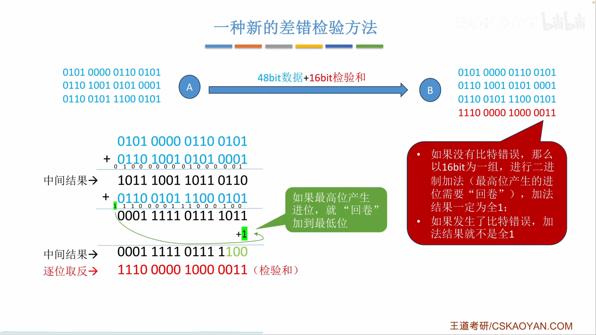
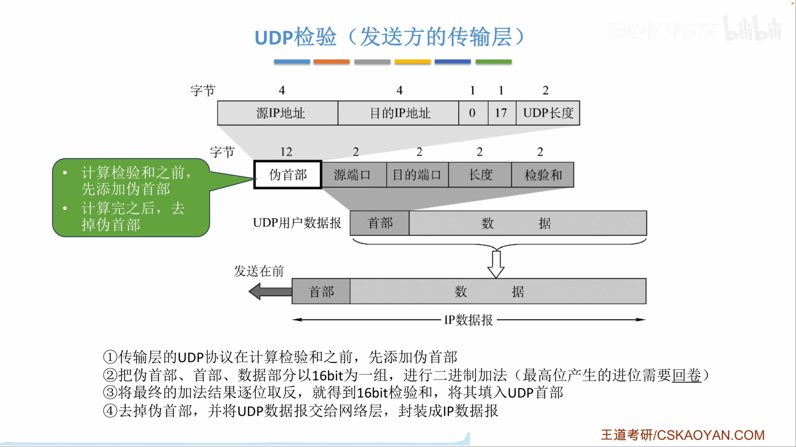
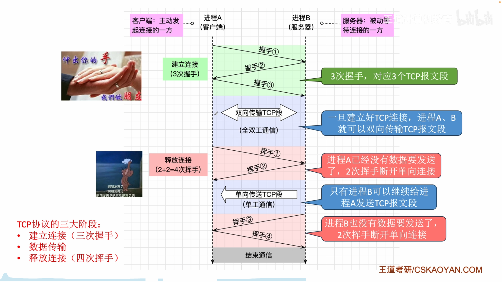
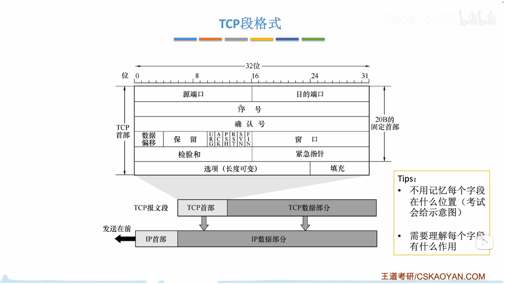

# 第五章 传输层

## 5.1 传输层提供的服务

网络层借助 IP 地址实现主机到主机的通信，传输层则借助端口号进一步实现进程到进程的通信。发送方传输层接收应用数据，加上 TCP 或 UDP 首部后交给 IP；接收方传输层根据目的端口把数据交给正确的应用进程。

```text
发送进程 -> TCP/UDP -> IP -> 网络 -> IP -> TCP/UDP -> 接收进程
             端口号    IP 地址          IP 地址    端口号
```

端口号长 16 位，取值范围是 `0` 至 `65535`。端口是每台主机、每种传输协议各自管理的资源，因此：

- 不同主机可以使用相同端口号。
- 同一主机上的 TCP 端口和 UDP 端口相互独立，例如 TCP 53 与 UDP 53 可以同时使用。
- 同一主机、同一传输协议中的端口不能被不兼容地重复绑定。

标准常把端口分为以下范围：

| 范围               | 名称          | 用途                              |
| ------------------ | ------------- | --------------------------------- |
| `0` 至 `1023`      | 熟知端口      | 分配给 HTTP、DNS、SMTP 等通用服务 |
| `1024` 至 `49151`  | 登记端口      | 可登记给特定应用或服务            |
| `49152` 至 `65535` | 动态/私有端口 | 常由客户端临时选择                |

服务器通常被动等待请求并绑定相对固定的端口，客户端主动发起通信并常使用临时端口。这个习惯不等于除熟知端口外的范围都具有强制的客户端、服务器归属。

套接字是程序使用网络通信端点的数据结构。对 TCP 连接，常用四元组唯一标识一条连接：

```text
(源 IP, 源端口, 目的 IP, 目的端口)
```

再加上传输协议，可区分 TCP 与 UDP 中数值相同的端口。

#### 复用与分用

- 复用发生在发送方向，多个应用进程都可把数据交给同一个 TCP 或 UDP 协议处理。
- 分用发生在接收方向，传输层依据协议和目的端口，把收到的数据交给对应进程。

TCP 和 UDP 都能用校验和检测比特差错，检测失败时都丢弃数据。区别在于，TCP 还用确认、重传、排序等机制恢复丢失或出错的数据，UDP 不负责恢复。

| 对比项   | TCP                              | UDP                          |
| -------- | -------------------------------- | ---------------------------- |
| 连接     | 面向连接，传输前建立、结束后释放 | 无连接，直接发送             |
| 可靠性   | 可靠、有序、无重复的字节流       | 尽最大努力交付               |
| 通信形式 | 一条连接对应两个端点，全双工     | 支持单播，也可配合广播或多播 |
| 流量控制 | 支持                             | 不支持                       |
| 拥塞控制 | 支持                             | 不支持                       |

## 5.2 UDP

### 5.2.1 UDP 数据报


UDP 面向报文。应用层每交付一个完整报文，UDP 就为它添加一个 8 字节首部，形成一个 UDP 数据报，并保留应用报文的边界。UDP 本身不负责把一个超长应用报文拆成多个 UDP 数据报，也不在接收端重组这些应用报文。


TCP 则面向字节流，可以把连续的应用数据按 MSS 切成多个 TCP 段，应用层原有的报文边界不会被 TCP 保留。


#### UDP 首部


UDP 长度字段的理论最大值为 `65535 B`。封装在无选项的 IPv4 数据报中时，受 IPv4 总长度限制，UDP 数据报最大为：

```text
65535 - 20 = 65515 B
```

其中还包括 8 B UDP 首部，因此应用数据最多为 `65507 B`。这是假设 IPv4 首部最短且不考虑链路 MTU 的上限，实际应用通常使用远小于该值的数据报，以免 IP 分片。

例如应用报文长 96 B，发送端口为 3666，接收端口为 9888，则 UDP 长度为：

```text
8 + 96 = 104 B
```

UDP 没有建立连接、确认重传、流量控制和拥塞控制，首部开销与发送时延较小。应用若需要可靠性，必须自行在应用层实现。UDP 可封装进单播、广播或多播 IP 数据报，因此适合实时音视频、DNS 查询等能容忍部分丢失或有自定义恢复机制的场景。


### 5.2.2 UDP 校验


UDP 使用 16 位反码校验和。计算前，把数据按 16 bit 分组，执行反码加法：普通二进制相加后，最高位产生的进位要回卷并加到最低位。发送方将最终和逐位取反，得到校验和。



```text
反码加法：16 位相加 -> 最高位进位回卷 -> 继续相加
发送方：所有字之和 -> 逐位取反 -> 写入校验和
接收方：所有字连同校验和相加 -> 结果全 1 表示通过
```

计算 UDP 校验和时，要临时在 UDP 数据报前增加 12 B IPv4 伪首部：



伪首部不是实际 UDP 首部，也不会在网络中传输。它让校验范围同时覆盖源、目的地址和上层协议号，可以检测数据报是否被错误地交给另一端点或另一协议。

发送端步骤：

1. 把 UDP 校验和字段暂置 0，构造伪首部。
2. 对伪首部、UDP 首部和数据按 16 bit 进行反码加法。若总字节数为奇数，在末尾临时补一个全 0 字节参与计算。
3. 将结果逐位取反，写入 UDP 校验和字段，再丢弃伪首部。

接收端重新构造同样的伪首部，把所有 16 位字连同收到的校验和一起做反码加法。结果为 16 位全 1 时接受，否则丢弃 UDP 数据报。

IPv4 中 UDP 校验和字段全 0 表示发送方未启用校验；IPv6 中 UDP 校验和通常必须使用。IPv4 首部校验和采用同一种反码算法，但只覆盖 IPv4 首部，不使用伪首部，也不覆盖 IP 数据部分。


## 5.3 TCP

### 5.3.1 TCP 协议的整体框架


TCP 工作分为三个阶段：三次握手建立连接，连接上进行全双工数据传输，四次挥手释放两个方向的连接。



主动发起连接的一方称为客户端，被动监听并接受连接的一方称为服务器。释放连接可以由任意一方先发起，不要求客户端先关闭。

TCP 连接是全双工的，两个方向各自独立传输。前两次挥手只说明一个方向不再发送数据，另一个方向仍可继续传输；待另一方也发送 FIN 并得到确认后，连接才完全关闭。


一次 TCP 连接可以连续传送多个应用报文，并不需要每传一个报文就重新握手。TCP 把应用层交来的数据视为连续字节流，按最大报文段长度 MSS 切分：

```text
应用报文 Y 1600 B | 应用报文 Z 1800 B
                  ↓ MSS = 1000 B
段1: Y[0..999]
段2: Y[1000..1599] + Z[0..399]
段3: Z[400..1399]
段4: Z[1400..1799]
```

一个 TCP 段的数据量可以小于 MSS，但不能超过协商的上限。MSS 只限制 TCP 数据部分，不包括 TCP 首部；通常选择合适的 MSS 以避免封装后的 IP 数据报被分片。TCP 在接收端依靠序号、确认和缓存把可能乱序到达的段恢复为有序字节流。

### 5.3.2 TCP 报文段

TCP 段由首部和数据组成。固定首部为 20 B，选项与填充使首部最大可达 60 B。



#### 序号、确认号和窗口

TCP 按字节编号。序号 `seq` 是本段数据第一个字节的序号。若一段的 `seq=1500`，携带 1000 B 数据，则下一段通常从 `seq=2500` 开始。

确认号 `ack` 表示期望对方下一次发送的字节序号，也表示此前所有字节都已按序收到。例如 `ack=2500` 表示序号小于 2500 的字节已收到。TCP 使用累计确认，即使后续段已经先到，只要 2500 开始的字节仍有缺口，确认号就不能越过该缺口。

窗口字段也写作 `rwnd` 或 `rcv_wnd`，单位是字节，表示接收方当前还允许对方发送多少数据，是 TCP 流量控制的基础。它反映接收缓冲区剩余空间，不等同于拥塞窗口。

#### 首部长度与控制位

数据偏移字段表示 TCP 首部长度，单位是 4 B。字段长 4 bit，因此最大值为 15，最大首部长度为 `15 x 4 = 60 B`。选项不足 4 B 整数倍时用填充补齐。TCP 首部没有总长度字段，TCP 段总长度由 IP 总长度减去 IP 首部长度得到。

| 标志位 | 含义                                     |
| ------ | ---------------------------------------- |
| URG    | 紧急指针有效                             |
| ACK    | 确认号有效；连接建立后的报文通常置 1     |
| PSH    | 请求接收端尽快把已收数据交给应用         |
| RST    | 复位连接，拒绝非法段或处理严重异常       |
| SYN    | 同步初始序号，用于建立连接               |
| FIN    | 发送方已经没有数据要发送，请求关闭本方向 |

三次握手中只有握手 1、握手 2 的 SYN 为 1；四次挥手中，主动关闭一方的第一个报文和另一方随后关闭时的报文 FIN 为 1。多个标志可以同时为 1，例如握手 2 通常同时是 SYN 段和 ACK 段。

校验和覆盖 TCP 伪首部、TCP 首部和数据。IPv4 伪首部结构与 UDP 类似，但协议号为 6，末尾长度是 TCP 首部与数据的总长度。

紧急指针仅在 URG 为 1 时有效，它与本段序号共同标识紧急数据边界。选项字段可在握手时携带 MSS 等参数。双方各自通告自己愿意接收的 MSS，因此两个方向的 MSS 可以不同。
